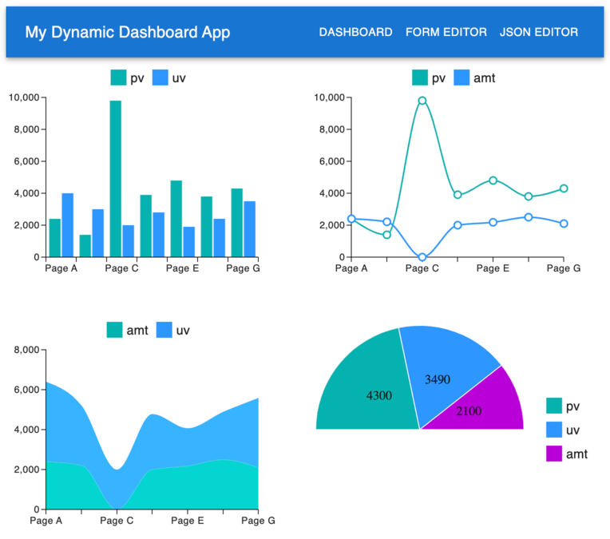
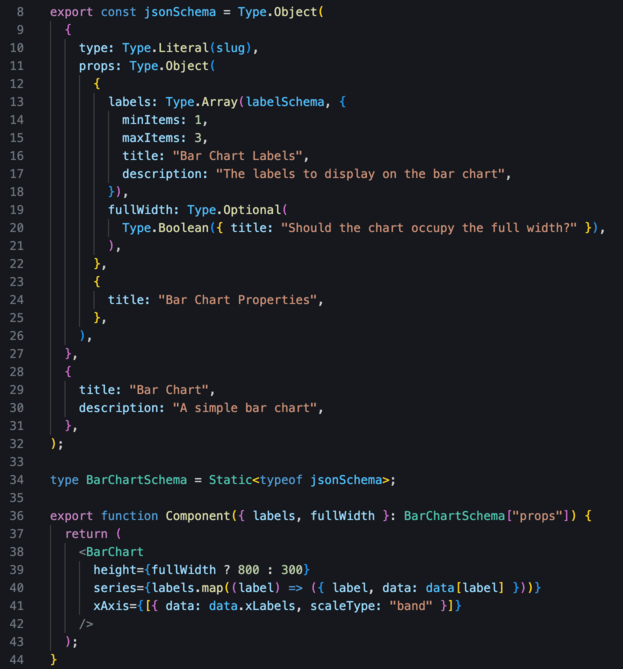
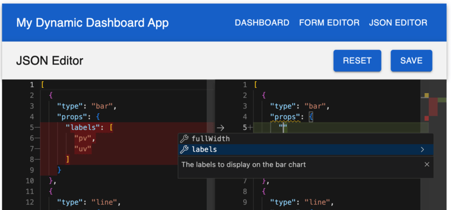
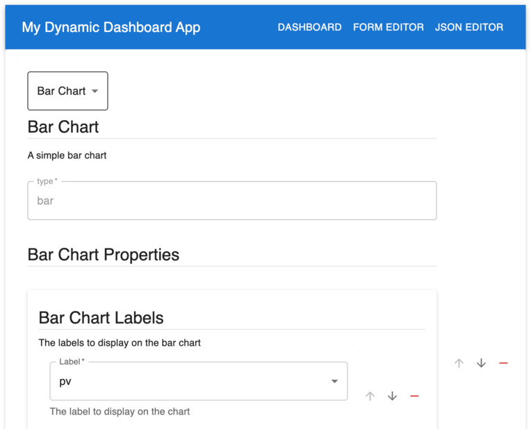

# React Dynamic Templating Demo

  
_Note: use 4 cores!_

   

This demo project showcases a type-safe templating system for React applications that is configurable via JSON.  
The configuration is defined by JSON schemas, declared alongside the template React components.  
Types are extracted directly from these schemas to ensure 100% type safety.  

The configuration is editable inside the React app via a form and a JSON editor page.  
The form is autogenerated from the JSON schema.  
The JSON editor is Monaco, the VSC backend, and offers IntelliSense and validation backed by the JSON schema.

- [React Dynamic Templating Demo](#react-dynamic-templating-demo)
  - [Screenshots](#screenshots)
  - [Who Needs This?](#who-needs-this)
  - [Technology Stack](#technology-stack)
  - [How It Works](#how-it-works)
    - [How Can I Rearrange the Dashboard?](#how-can-i-rearrange-the-dashboard)
    - [How Can I Add a New ChartComponent?](#how-can-i-add-a-new-chartcomponent)
    - [Sounds Complicated, Can You Give Me an Example?](#sounds-complicated-can-you-give-me-an-example)
  - [Missing Features In This Demo](#missing-features-in-this-demo)
  - [Is This Production-Ready?](#is-this-production-ready)
  - [I Find the Lack of Testing Disturbing](#i-find-the-lack-of-testing-disturbing)
  - [Contact](#contact)

## Screenshots

_Configurable dashboard PoC displaying dynamic components_  

_Code snippet demonstrating the declaration of a component and its JSON-schema based configuration._  

_In-browser app configuration via JSON editor, featuring IntelliSense support provided by the JSON schema, and a Diff view for comparing configurations_  

_In-browser app configuration via forms, automatically generated from the JSON schema for easy configuration adjustments_  

## Who Needs This?

If you’re building a React application with a variety of complex, configurable features, this template helps by enabling a 100% type-safe templating.  

## Technology Stack

- **[React](https://react.dev/)**: uses `create-react-app` + `react-router-dom` just for demo purposes.
- **[MUI](https://mui.com/material-ui/)**: Supplies fundamental UI components and charts.
- **[TypeScript](https://www.typescriptlang.org/)**: Ensures type safety across components.
- **[TypeBox](https://github.com/sinclairzx81/typebox)**: A TypeScript library for defining JSON schemas and extracting type-safe interfaces, making "impossible _configuration_ states impossible".
- **[AJV](https://ajv.js.org/)**: A JSON schema validator to validate the configuration.
- **[react-jsonschema-form](https://github.com/rjsf-team/react-jsonschema-form)**: Dynamically generates forms based on JSON schema definitions, allowing new fields and components to be added without additional code.
- **[Monaco Editor](https://microsoft.github.io/monaco-editor/)**: Runs Visual Studio Code’s backend in the browser, providing a JSON editor with IntelliSense and diff support.

## How It Works

This templating system utilizes JSON schema to configure component layouts, enabling dynamic form rendering and editable configurations. Here’s a breakdown of the main components:

- [`src/lib/chartComponents/*`](src/lib/chartComponents/SimpleBarChart.tsx)  
   Contains the ChartComponents available in this demo. Each ChartComponent exports:

  - `slug`: a unique identifier for the component.
  - `jsonSchema`: a schema describing the component’s configuration options.
  - `Component`: the React component itself, which receives `Props` as defined by the `jsonSchema`.

- [`src/lib/chartComponents/index.ts`](src/lib/chartComponents/index.ts)  
   Exports all ChartComponents in a single array.

- [`src/jsonSchema.ts`](src/jsonSchema.ts)  
   Provides the JSON schema setup for data validation.

- [`src/pages/configuration.tsx`](src/pages/configuration.tsx)  
   Uses the Browser LocalStorage API to simulate a configuration repository.

- [`src/pages/Dashboard.tsx`](src/pages/Dashboard.tsx)  
   Reads configuration settings and renders the appropriate components with their respective props.

- [`src/lib/TypeToComp.tsx`](src/lib/TypeToComp.tsx)  
   A TypeScript utility that helps track and enforce correct types for each component.

- [`src/pages/FormEditor.tsx`](src/pages/FormEditor.tsx)  
   Uses `rjsf` to render a form based on the JSON schema. This form is fully dynamic, meaning no additional code is required to add new fields or components.  
   _`rjsf` is a neat library that can be customized including support for custom components. See their [Playground](https://rjsf-team.github.io/react-jsonschema-form/) for more examples._

- [`src/pages/JsonEditor.tsx`](src/pages/JsonEditor.tsx)  
   Utilizes Monaco Editor to edit JSON schema with a Diff view, supporting IntelliSense based on schema declarations.

### How Can I Rearrange the Dashboard?

1. Launch the app and change the configuration using either the Form or the JSON editor.
2. Save, and the app will refresh to update the configuration.  
   _Both the Form and JSON editor enforce validation to prevent invalid configurations from being stored._
3. The Dashboard will then reflect the updated configuration.

### How Can I Add a New ChartComponent?

1. Create a new ChartComponent in `src/lib/chartComponents/`.
2. Export the required keys: `Component`, `jsonSchema`, `slug`.
3. Add the new ChartComponent to the `charts` array in `src/lib/chartComponents/index.ts`.

### Sounds Complicated, Can You Give Me an Example?

Sure, check this commit [1fe4a03](https://github.com/erikologic/dynamic-template/commit/1fe4a036afd53fad83d8ac53e2ae13de880234e0)!

The following files were modified:

- `src/configuration.tsx`: to add a default configuration for the new component.
- `src/lib/chartComponents/StraightAnglePieChart.tsx`: to create the new ChartComponent.
- `src/lib/chartComponents/index.ts`: to export the new ChartComponent.

## Missing Features In This Demo

- **Templating for Routing**: Enable configuration at the navigation level, allowing multiple pages to be templated and the NavBar to be dynamically updated.
- **Configuration Backend**: including features like:
  - Optimistic concurrency control to avoid overwriting changes made by others.
  - Aliased configurations for easy comparison of different setups side by side.
- **Complex Nesting**: Support for even deeper and more nested component structures.
- **RJSF UISchema and Custom Widgets**: More customization options for form generation.
- **Monaco Diff/Single View Switch**: Enable users to toggle between views and collapse/expand JSON structures.
- **Next.js Integration**: Combine this setup with a framework like Next.js, including SSG/SSR support.

## Is This Production-Ready?

Yes, it’s stable and running in production environments.  
We initially worried about non-engineers using the JSON editor, but it has proven safe and intuitive even for less technical users.

## I Find the Lack of Testing Disturbing

I'm a TDD addict. I hear you.

This system is 100% typesafe.  
The only untested behavior is the configuration get/put functions, which can be tested with any of your regular Adapter testing strategies.

## Contact

Buzz me on [LinkedIn](https://www.linkedin.com/in/enrico-graziani-10ba5a140/)!
